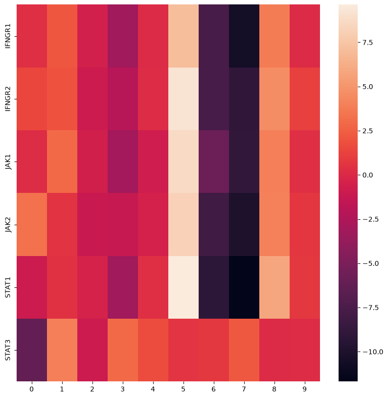
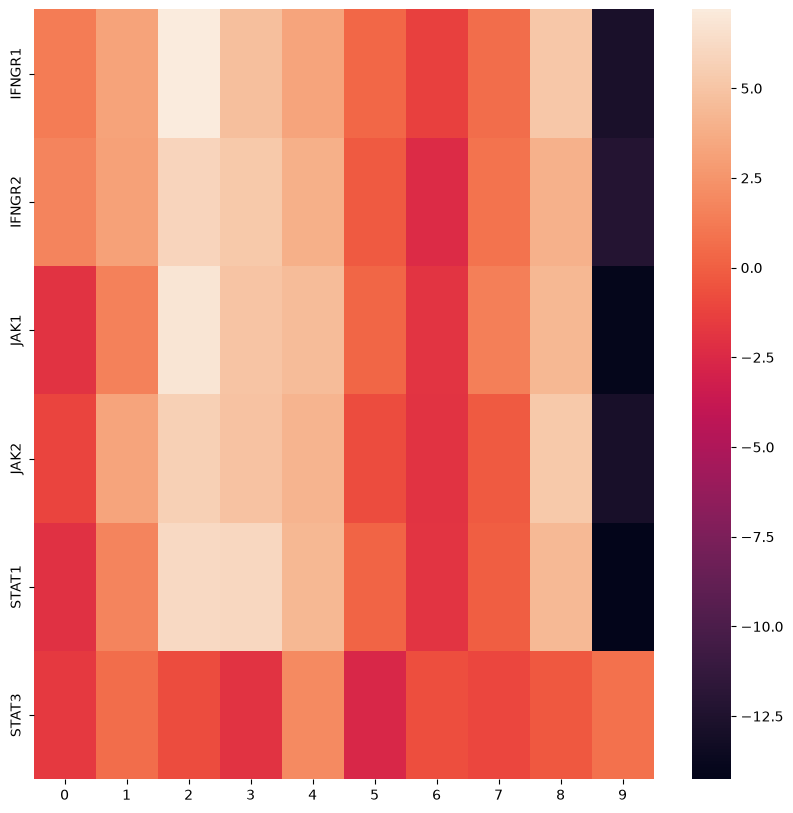
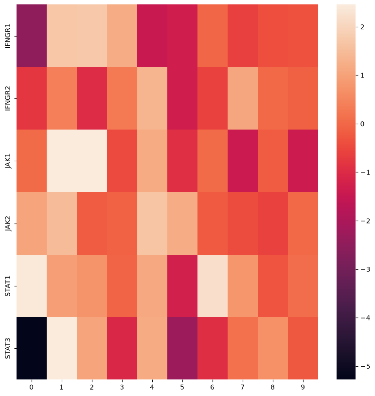

## Clustering
### Task
Which genetic perturbations show similar effects, if any? Which clustering method(s) best
capture(s) the underlying biology?

Apply different clustering methods to the data, visualize and compare the results. Students
working alone only need to use data from the co-culture condition. Interpret the results
biologically. Do the clusters correspond to what you would expect based on the findings
described in the paper, e.g., the pathways that are discussed?

### Data Selection
Data from Frangieh et al. [3] was preprocessed through the scmlcource.preprocessing.preprocess function, which wraps the workflow in QC_new.ipynb. Additionally, for clustering, we filter out perturbation conditions that are represented by fewer than 100 cells.

### Clustering Methods
For clustering we choose two widespread and accessible methods:
1. #### Leiden Clustering
    Leiden clustering is one of the most widely used clustering methods in scRNA data analysis. We use scanpy's [7] implementation in the scanpy.tl.leiden function.
    Leiden clustering was developed by [1], as an improvement on the Louvain clustering algorithm by [2]. A graphical description of the Louvain algorithm is depicted here:
    
    Leiden clustering has additional refinement steps between modularity optimization and agglomeration, in order to break up weakly connected groups.

    As input for Leiden clustering, scanpy.tl.leiden uses a neighbour graph that is generated from principal component (PC) loadings.

2. #### K-Means clustering
    This is a relatively simple clustering method that results in non-hierarchical separation. Observations are aggregated and separated, based on a distance metric, into a predetermined number of *k* clusters. This figure describes the algorithm:

    

    We utilize scikit-learn's [4] implementation of k-means clustering in sklearn.cluster.KMeans. As input we use the PCA loadings from scanpy's scanpy.tl.pca function.

We calibrate Leiden clustering to a resolution of 0.2 and k-means clustering with k=5, resulting in ca. 5 clusters each. This allows manual interpretation of the clustering results.

### Discussion
We clustered the scRNA dataset by Frangieh et al. [3] using k-means and Leiden clustering for all three conditions, Control, Co-Culture, and IFNγ, separately.
Here, PCA results already show some interesting patterns in the IFNγ condition and Co-Culture condition,

which may be due to the activation and thereby high expression in the downstream pathway of IFNγ treatment.
In the control condition, this is not the case:

Notably, in line with the results of Frangieh et al. [3], this observation is not shared by CD58.

After clustering, we performed ranked gene-set enrichment analysis (rGSEA) on the clusters, using the per-perturbation cell count as a ranking metric for the target genes.
Using the classification table (Supplementary Table 5) supplied by Frangieh et al. [3] did not result in coherent gene sets, since this classification only provides descriptions for a small subset of perturbation targets. To still perform meaningful analysis of the generated clusters, we performed ranked gene set enrichment analysis using the gseapy library [5] with the "MSigDB_Hallmark_2020" gene set [6].

Here we get a relatively granular reference that provides good classification for some of the generated clusters.
One example of a good classification is Leiden cluster 3 for the control condition, which mostly consists of cells with perturbations in the unfolded protein response:

This essential pathway is likely easier to cluster together, because it is constitutively expressed in all cells and its disruption has widespread implications for transcription and translation.

In all conditions, there are clusters that are not well defined by rGSEA. Leiden cluster 3 in the co-culture condition, for example, shows a high degree of enrichment in a small number of perturbation targets that could not be linked to a gene set:

Apart from these observations, a thorough analysis of the rGSEA results would arguably provide additional insights into the mechanics of the clustering and the effect size of specific perturbations.

Another avenue of investigation may be to perform clustering on a subset of principal components. Here, bootstrapping might be useful to find PCs containing mainly noise.

### References
- [1]: V. A. Traag, L. Waltman, and N. J. van Eck. From louvain to leiden: guaranteeing well-connected communities. Scientific Reports, mar 2019. URL: https://doi.org/10.1038/s41598-019-41695-z, doi:10.1038/s41598-019-41695-z.
- [2]: Vincent D Blondel, Jean-Loup Guillaume, Renaud Lambiotte, and Etienne Lefebvre. Fast unfolding of communities in large networks. Journal of Statistical Mechanics: Theory and Experiment, 2008(10):P10008, oct 2008. URL: https://doi.org/10.1088/1742-5468/2008/10/P10008, doi:10.1088/1742-5468/2008/10/p10008.
- [3]: Chris J. Frangieh, Johannes C. Melms, Pratiksha I. Thakore, Kathryn R. Geiger-Schuller, et al. Multimodal pooled Perturb-CITE-seq screens in patient models define mechanisms of cancer immune evasion. Nature Genetics, 53:332–341, 2021. doi:10.1038/s41588-021-00779-1.
- [4]: Fabian Pedregosa, Gaël Varoquaux, Alexandre Gramfort, Vincent Michel, Bertrand Thirion, Olivier Grisel, Mathieu Blondel, Peter Prettenhofer, Ron Weiss, Vincent Dubourg, Jake Vanderplas, Alexandre Passos, David Cournapeau, Matthieu Brucher, Matthieu Perrot, and Édouard Duchesnay. Scikit-learn: machine learning in Python. Journal of Machine Learning Research, 12:2825–2830, 2011.
- [5]: Zhuoqing Fang, Xinyuan Liu, and Gary Peltz. GSEApy: a comprehensive package for performing gene set enrichment analysis in Python. Bioinformatics, 39(1):btac757, 2023. doi:10.1093/bioinformatics/btac757.
- [6]: Arthur Liberzon, Chet Birger, Helga Thorvaldsdóttir, Mahmoud Ghandi, Jill P. Mesirov, and Pablo Tamayo. The Molecular Signatures Database (MSigDB) hallmark gene set collection. Cell Systems, 1(6):417–425, 2015. doi:10.1016/j.cels.2015.12.004.
- [7]: F. Alexander Wolf, Philipp Angerer, and Fabian J. Theis. SCANPY: large-scale single-cell gene expression data analysis. Genome Biology, 19(1):15, 2018. doi:10.1186/s13059-017-1382-0.